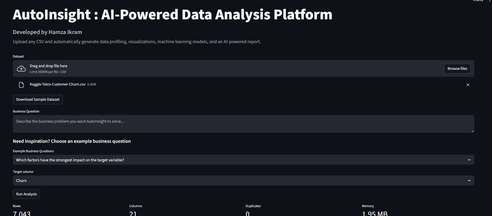
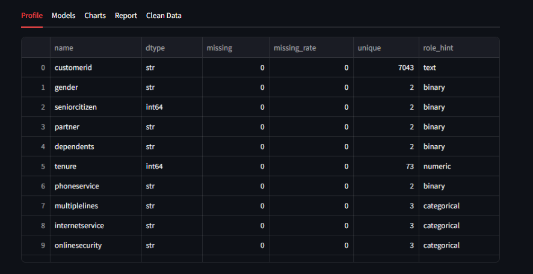
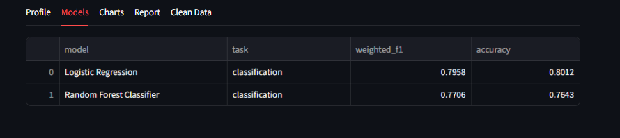
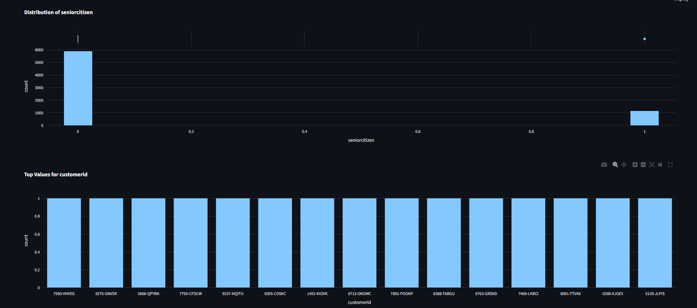
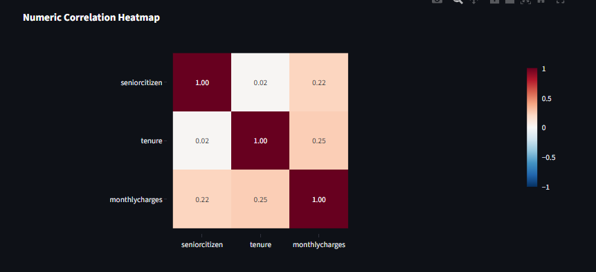
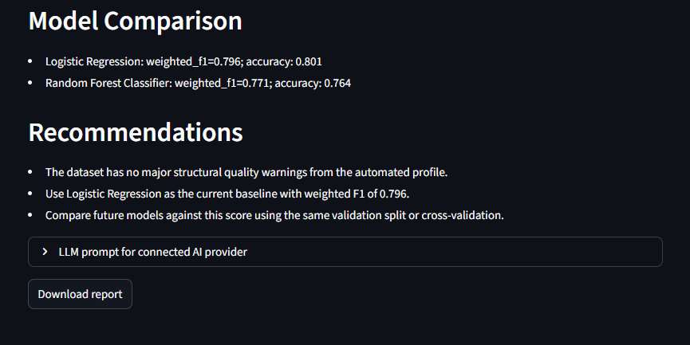
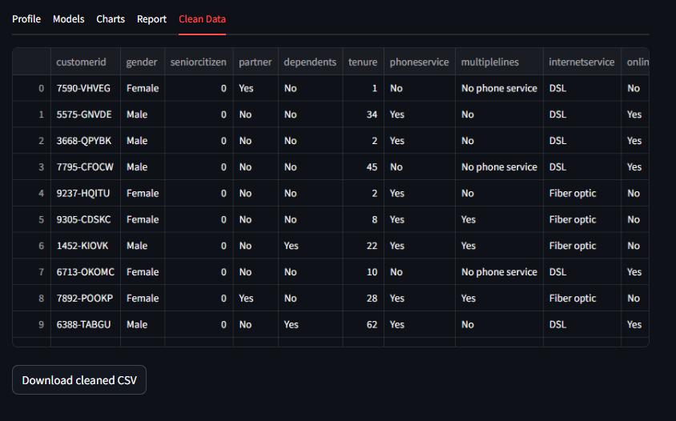

# AutoInsight: AI-Powered Data Analysis Platform

An end-to-end Streamlit app that turns any CSV into a full analysis — automated data profiling, cleaning, visualizations, baseline ML models, and a downloadable AI-style report — all driven by a plain-English business question.

> Live Demo:** [autoinsight-26.streamlit.app](https://autoinsight-26.streamlit.app/)

## Project Overview

Most exploratory data analysis follows the same repetitive steps: profile the data, clean it, pick a target, try a couple of models, chart the results, and write up findings. AutoInsight automates that entire loop — upload a dataset, ask a business question in plain English, and it infers the target column, cleans and profiles the data, trains and compares baseline models, generates visualizations, and produces a markdown report, all in one run.

**Demonstrated on:**
- [Telco Customer Churn (Kaggle)](https://www.kaggle.com/datasets/blastchar/telco-customer-churn) — 7,043 rows, 21 columns
- Business question: *"Which customers are most likely to churn, and what factors contribute to their churn?"*

> **Note on data:** The sample dataset bundled with the app is a public Kaggle dataset used to demonstrate the pipeline end-to-end. AutoInsight itself is dataset-agnostic — any reasonably clean tabular CSV can be uploaded.

## Business Problem-Solving & Skills Demonstrated

**Business Problem-Solving (Data Analyst Lens)**
- Converts a plain-English business question (*"which customers are most likely to churn?"*) directly into an analysis plan — no manual column mapping required
- Automated data-quality triage (missingness, duplicates, identifier detection) surfaces issues that would otherwise silently bias a business decision
- Produces stakeholder-ready output: a plain-language AI summary, a model comparison table, and prioritized recommendations — not just raw numbers
- Designed around a "ask → analyze → recommend" workflow that mirrors how a data analyst would actually scope and deliver a stakeholder request

**Data Science & Machine Learning**
- Automated **task-type inference** (classification vs. regression) driven by target cardinality and dtype
- Full **feature engineering pipeline** — median/mode imputation, standard scaling, one-hot encoding — via `sklearn.ColumnTransformer`
- **Leakage-aware modeling**: identifier-like columns (`id`, `*_id`, `customerid`) are automatically excluded from training
- **Baseline model benchmarking** — Logistic Regression / Ridge as an interpretable baseline against Random Forest, evaluated with task-appropriate metrics (weighted F1 + accuracy for classification; R² + MAE + RMSE for regression)
- Stratified train/test splitting to preserve class balance on imbalanced targets (e.g., churn)

**Tools & Technologies**


## Tech Stack

`Python` · `Streamlit` · `Pandas` · `Scikit-learn` · `Plotly`

## Methodology

1. **Validation** — Rejects empty datasets, single-column datasets, or all-blank rows before any processing begins (`validation.py`).
2. **Cleaning** — Normalizes column names, drops duplicate rows, removes columns with >60% missing values, and auto-detects/parses date-like text columns (`cleaning.py`).
3. **Profiling** — Computes per-column dtype, missing rate, cardinality, and a **role hint** (identifier / binary / numeric / datetime / categorical / text) used downstream to decide what to model and what to exclude (`profiling.py`).
4. **Target Inference** — Matches the business question against column names, falls back to a keyword list (`churn`, `revenue`, `risk`, `price`, etc.), and finally to the last usable non-identifier column — or lets the user override it manually (`targeting.py`).
5. **Feature Engineering** — Builds a `ColumnTransformer` pipeline: median imputation + standard scaling for numeric features, most-frequent imputation + one-hot encoding for categorical features, with identifier-like columns automatically excluded (`features.py`).
6. **Modeling** — Trains two baseline models per task type (Logistic Regression + Random Forest for classification; Ridge + Random Forest for regression) on a stratified 75/25 split, and ranks them by weighted F1 or R² (`modeling.py`).
7. **Visualization** — Generates a missingness chart, a numeric distribution histogram, a categorical top-values chart, and a correlation heatmap on the fly using Plotly (`charts.py`).
8. **Reporting** — Assembles dataset overview, modeling setup, model comparison, and auto-generated recommendations into a downloadable markdown report, plus a plug-in-ready prompt for a connected LLM provider (`reporting.py`, `ai_narrative.py`).

## Walkthrough

### 1. Upload & Configure
Upload a CSV, type (or select) a business question, and optionally override the target column.



### 2. Automated Data Profile
Every column is profiled for missing data, cardinality, and inferred role — no manual `.info()` / `.describe()` needed.



### 3. Baseline Model Comparison
Two baseline models are trained automatically and ranked by score, so there's an immediate benchmark to beat.



### 4. Auto-Generated Visualizations
Missingness, distributions, top categories, and a correlation heatmap are generated without writing a single line of plotting code.




### 5. AI-Style Report
A rule-based summary plus a full markdown report — including a ready-to-use prompt for a connected LLM provider — all downloadable.



### 6. Cleaned Data, Ready to Export
The cleaned dataset (deduplicated, high-missing columns dropped, dates parsed) is browsable and downloadable directly from the app.



## Results (Telco Churn Example)

| Model | Weighted F1 | Accuracy |
|---|---|---|
| **Logistic Regression** | **0.796** | 0.801 |
| Random Forest Classifier | 0.771 | 0.764 |

- Dataset: 7,043 rows, 21 columns, 0 duplicates
- Inferred target: `churn` · Task: classification
- Logistic Regression edges out Random Forest here — a reminder that a well-regularized linear baseline can beat a more complex model on clean, moderately-sized tabular data.

## Known Limitations & Honest Learnings

Keeping this section here deliberately, same as I do on my other projects:

- **The "AI Summary" is currently rule-based, not a live LLM call.** `ai_narrative.py` includes a `deterministic_ai_summary()` function (template-driven, using the actual profiling/model results) *and* a separate `build_ai_prompt()` function that assembles a ready-to-use prompt for a connected LLM provider — but no API call is wired in yet. This was a deliberate scoping choice to keep the app fully functional and free to run without requiring an API key, while leaving a clean integration point for a real LLM.
- **Only two baseline models per task type** are trained (Logistic Regression/Ridge + Random Forest) — enough for a quick benchmark, not a full model search (no hyperparameter tuning, no gradient boosting yet).
- **Target inference is heuristic**, matching column names against the business question and a fixed keyword list — it works well for common naming conventions but can be overridden manually when it guesses wrong.

## Planned Improvements

- Wire up an actual LLM call behind `build_ai_prompt()` for a genuinely AI-generated narrative report
- Add gradient boosting models (XGBoost/LightGBM) and basic hyperparameter tuning
- Add SHAP-based feature importance for model explainability
- Support multi-file / multi-table uploads with a join step before profiling

## Repository Structure

```
├── app.py                      # Streamlit UI and orchestration entry point
├── .streamlit/                 # Streamlit app configuration
├── src/AutoInsight/
│   ├── validation.py           # Input dataset validation
│   ├── cleaning.py             # Deduplication, missing-column removal, date parsing
│   ├── profiling.py            # Column-level and dataset-level profiling
│   ├── targeting.py            # Target column & task type inference
│   ├── features.py             # Preprocessing pipeline (imputation, scaling, encoding)
│   ├── modeling.py             # Baseline model training & evaluation
│   ├── charts.py                # Plotly chart generation
│   ├── ai_narrative.py         # Deterministic summary + LLM prompt builder
│   ├── reporting.py            # Markdown report assembly
│   ├── recommendations.py      # Data-quality and modeling recommendations
│   ├── schema.py               # Typed dataclasses shared across modules
│   └── orchestrator.py         # Runs the full pipeline end-to-end
├── example dataset/
│   └── Kaggle-Telco-Customer-Churn.csv
├── results/                    # App screenshots used in this README
├── tests/                      # Unit tests
├── requirements.txt
└── README.md
```

## Getting Started

```bash
git clone https://github.com/hamzaikram2026/AutoInsight-Automated_EDA-Predictive_Modeling_Pipeline-.git
cd AutoInsight-Automated_EDA-Predictive_Modeling_Pipeline-
pip install -r requirements.txt
streamlit run app.py
```
## More of my work

- **[Pharmaceutical Inventory Demand Forecasting](https://github.com/hamzaikram2026/Pharmaceutical-Inventory-Demand-Forecasting-using-Machine-Learning)** Time-series demand forecasting for pharma inventory using `RandomForestRegressor` (R² = 0.95)
- **[Automated Text Structuring Pipeline](https://github.com/hamzaikram2026/Automated_Text_Structuring_Pipeline)** — Pipeline that Transforms Unstructure raw ingredient text into clean Structured Data using Natural Language Processing.

---
*Hamza Ikram — [GitHub](https://github.com/hamzaikram2026)*


## License

This project is open-sourced for educational and portfolio purposes.
